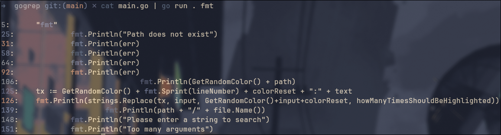

# gogrep
This is an attempt to recreate some parts of ripgrep using go
## Disclaimer
⚠️ I'm making gogrep for learning purposes, both fun and challenging. It's still on a really early stage but we will see what it will become ⚠️

### Why not just use ripgrep
There's no reason to use gogrep over ripgrep. <br>
Ripgrep is more feature rich and stable, Gogrep is only a personal project

### Features
- 🚀 Blazingly Fast
- 🛠️ Easy Understand and use
- 📦 Maintainable Code (Small Code Base)
- 🎨 Randomly assigns colors to your results

### Usage
##### Directory as input
 <br>
- <b>go run .</b>: is used to run the go code in the current directory
- <b>"go"</b>: is the input string to look for
- <b>.</b>: indicating the current directory

##### File as input


##### Piped Input


### Installation
```
git clone https://github.com/MohamedBenMassouda/gogrep && cd gogrep
```
```
go run . "🚀" .
```
