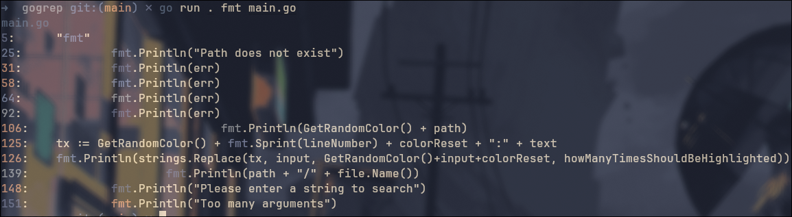

# gogrep
Gogrep is a command-line tool written in Go for searching text within files.

## Why Gogrep
Learning Linux is an exciting journey, and It got me to love open source even more. <br>
Gogrep was born out of the desire to provide a quick and convenient way to inspect file content without the need to open a text editor like Neovim.<br>
#### Challenges with Existing Solutions
While using commands like `cat` and piping the result to `grep` does the job, but sometimes suffers from performance issues, especially with larger files.
I tried `ripgrep` for a change it was significally faster and more efficient searches. <br>
But I wanted to learn what those tools do under the hood

## Features
- 🚀 Blazingly Fast
- 🛠️ Easy Understand and use
- 📦 Maintainable Code (Small Code Base)
- 🎨 Randomly assigns colors to your results


## Project Structure
- main.go: The main entry point of the Gogrep tool.
- src/: Directory containing source code files.
    - args.go: Functions related to handling command-line arguments.
    - color.go: Functions for working with terminal colors.
    - file.go: File-related utility functions.
    - path.go: Functions related to working with file paths.
    - print.go: Functions for printing results.
    - run.go: Core functionality for searching and processing files.
    - utils.go: General utility functions.

## Usage
##### Directory as input
 <br>
- <b>go run .</b>: is used to run the go code in the current directory
- <b>"go"</b>: is the input string to look for
- <b>.</b>: indicating the current directory

##### File as input


##### Piped Input


## Installation
### Go
```bash
go install github.com/MohamedBenMassouda/gogrep@latest
```
```bash
$GOPATH/bin/gogrep test
```

### Git
```bash
git clone https://github.com/MohamedBenMassouda/gogrep && cd gogrep
```
```bash
go run . "🚀" .
```

## License
[MIT](https://choosealicense.com/licenses/mit/)
